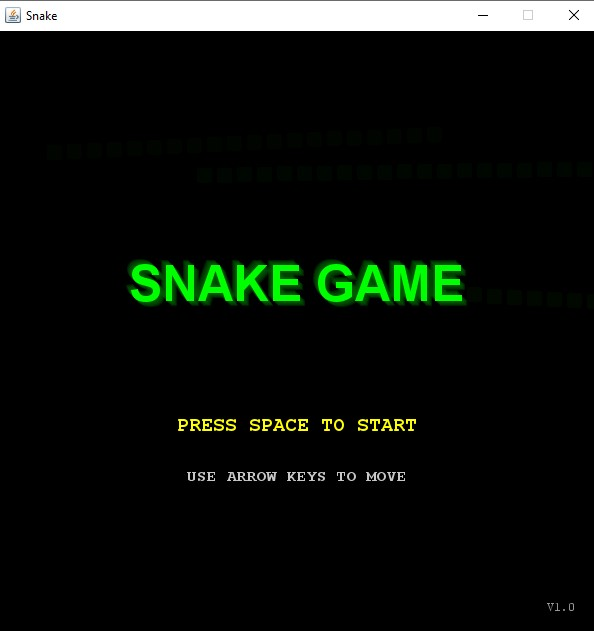
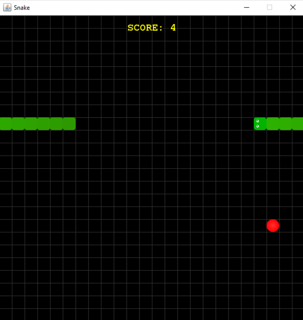
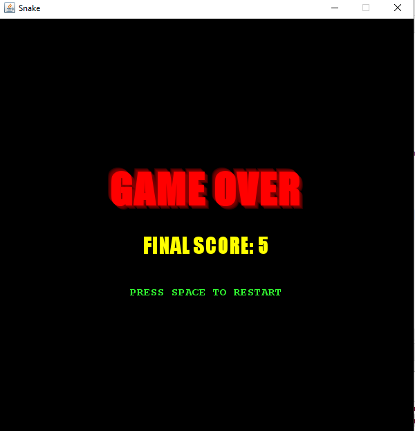

# Snake Game 🎮

A modernized version of the classic Snake game implemented in Java, featuring smooth graphics, arcade-style effects, and intuitive gameplay. 🐍

## Features ✨

- **Smooth Gameplay**: Enjoy fluid animations with antialiasing and gradient effects.
- **Arcade-Style Design**: Includes retro fonts, glowing text effects, and vibrant colors.
- **Dynamic Grid**: A visually appealing grid layout for better gameplay experience.
- **Wrap-Around Mechanics**: The snake can pass through walls and appear on the opposite side.
- **Interactive UI**: Displays the score in real-time and shows game-over messages with restart instructions.

## Gameplay Instructions 🎮

- Use the arrow keys to control the snake's direction:
  - `↑` Up
  - `↓` Down
  - `←` Left
  - `→` Right
- Collect apples to grow your snake and increase your score.
- Avoid colliding with your own body!
- Press `Space` to restart the game after a Game Over.

## How to Run 🚀

1. Clone this repository:

```bash

```

2. Run the program:

```bash

```

## Screenshots 📸

### Game Start Screen



### GamePlay



### Game Over Screen



## Project Structure 📂

```
snake_Game/
├── bin/
│ └── com/
│   └──(all the class files)
├── src/
│ └── com/
│   └──snakeGame/
|     └──Game.java 
|     ├──GameFrame.java 
|     ├──GamePanel.java # Main game logic
└── README.md # Project documentation
```

## Technologies Used 🛠️

- **Programming Language**: [Java](https://www.oracle.com/java/)
- **Graphics**: Java Swing and AWT for rendering

## Future Enhancements 🚀

- Add difficulty levels (easy, medium, hard).
- Introduce new power-ups or obstacles.
- Implement multiplayer mode.
- Add sound effects and background music.

## Contributing 🤝

Contributions are welcome! Feel free to fork this repository and submit pull requests. For major changes, please open an issue first to discuss what you would like to change.

Enjoy playing Snake! 🐍✨
